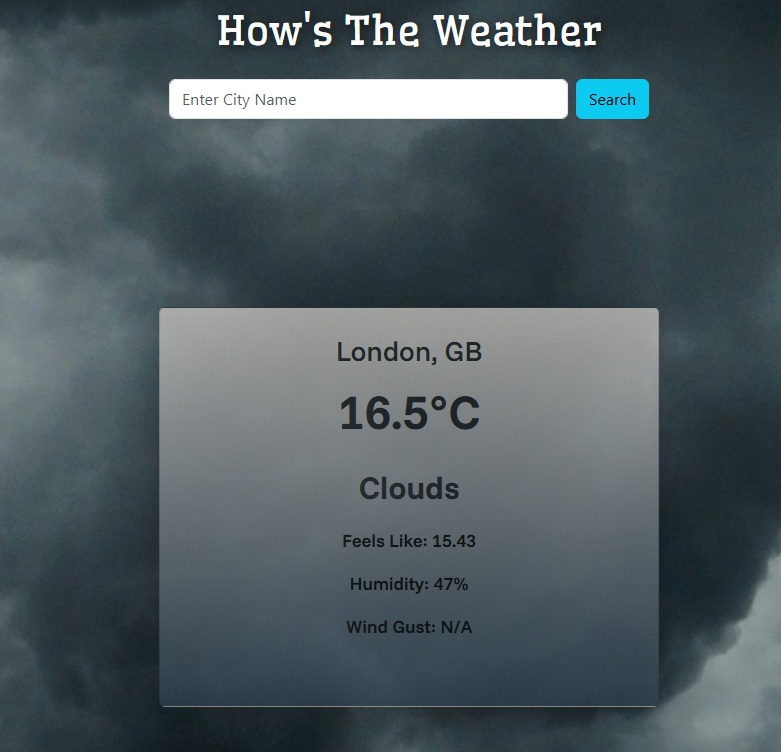

# 🌦 Weather App

A simple, responsive weather application built with **React + Vite** and powered by the **OpenWeather API**.

## ✨ Features
- 🌍 Search weather by city name  
- 🌤 Displays temperature, feels-like, humidity, and wind gusts  
- 🎨 Dynamic background images based on weather conditions  
- 📱 Responsive design (works on desktop & mobile)  
- ⚡ Built with React + Vite for fast development and hot reloading

## 🛠️ Tech Stack
- React + Vite
- React-Bootstrap for styling
- OpenWeatherMap API for weather data

## 🖼 Preview

